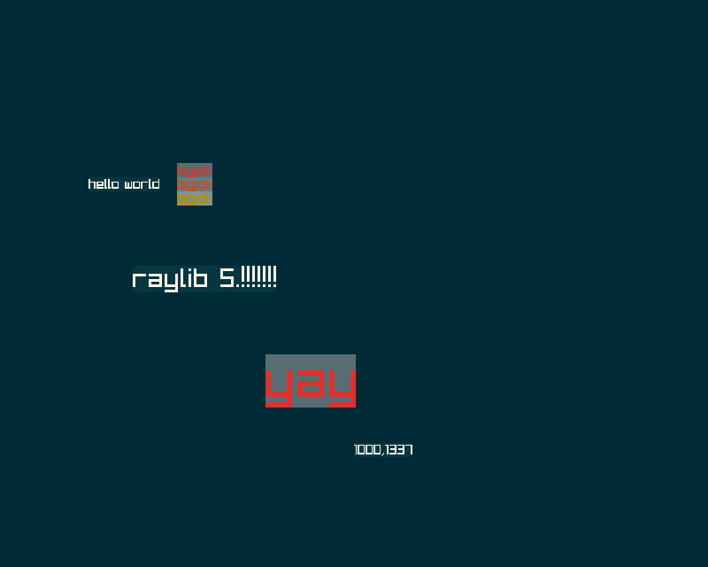
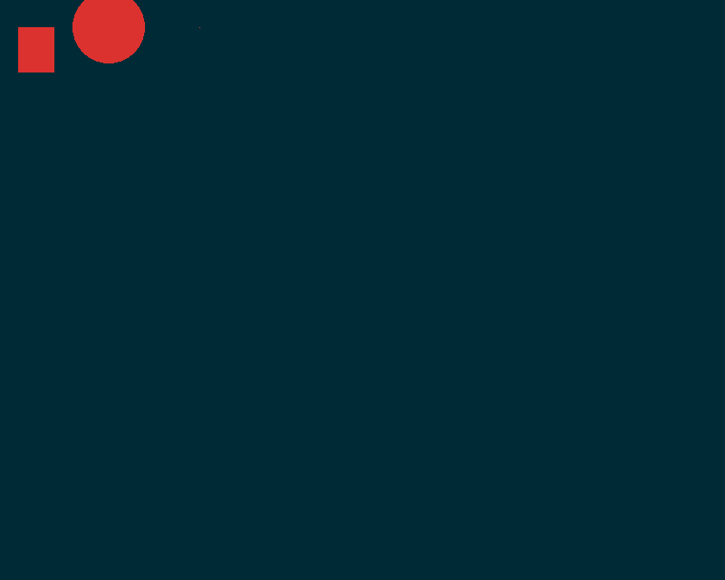
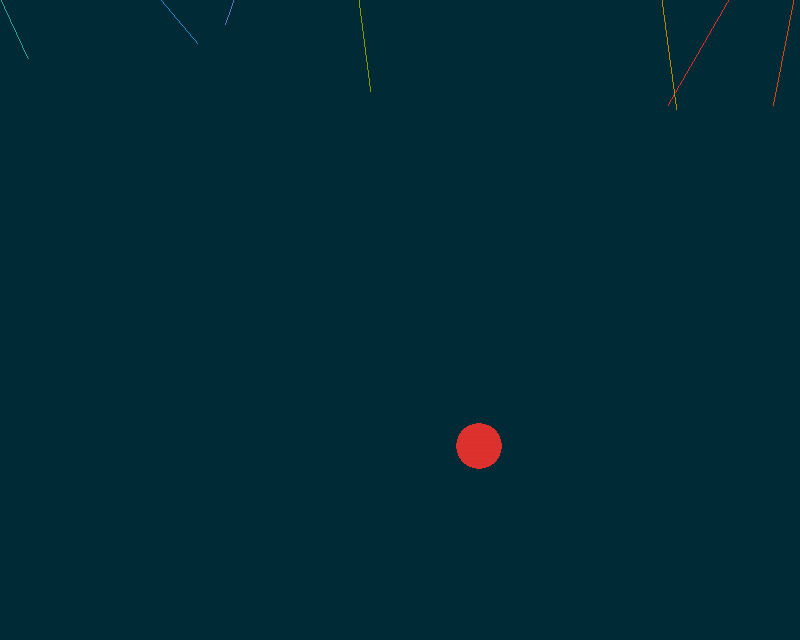
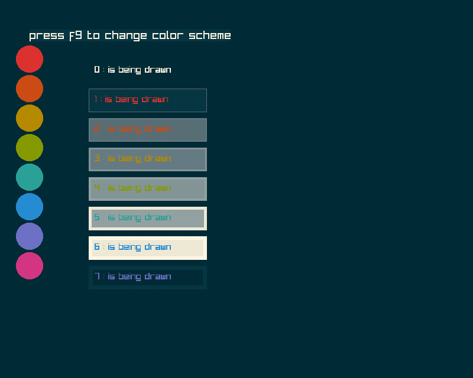
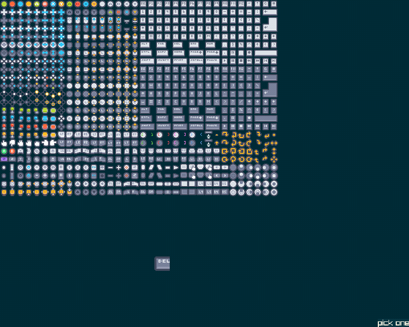
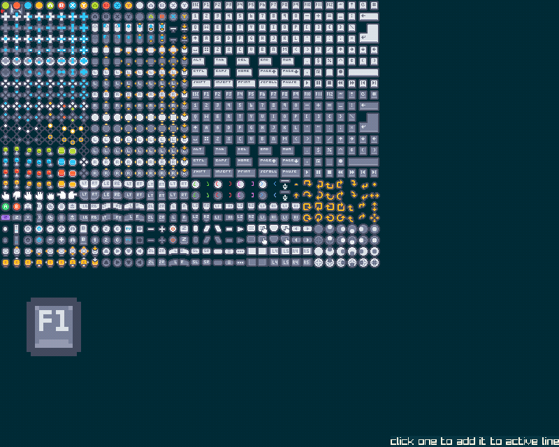

### Examples

examples are surprizinly in the examples folder, this is the expected output and some explaination of what I expect it to show

## [helloworld](../examples/001-helloworld.d)

Drawing text, some random syntax for my string type, and colors; messy rn

## [drawtest](../examples/002-drawtest.d)

the api I had in mind depends on named arguments working with templates; they dont,
waiting on if that changes before making a complicated workaround

## [buttons and messages](../examples/003-buttons-and-messages.d)

(interactive but boring skiping image)

status and button syntax, read the damn code and trust

## [debuging](../examples/004-debuging.d)

(interactive but boring skiping image)

using "watch" to add a varible to the debug menu on F2

## [missle command](../examples/005-misslecommand.d)

https://monkyyy.itch.io/test-wasm-missle-command

Simple dumb game, showing patterns for how id use colors, a data stucture

## [colorscheme](../examples/006-colorscheme.d)

showings the colorschemes, and some color syntax

## [sprites](../examples/007-sprites.d)

sprite sheet loading

## [typing](../examples/008-typing.d)

single line typing

## [keybinding tools](..examples/009-keybindingstool.d)

https://monkyyy.itch.io/keybinding-tool

Tool for making keybindings